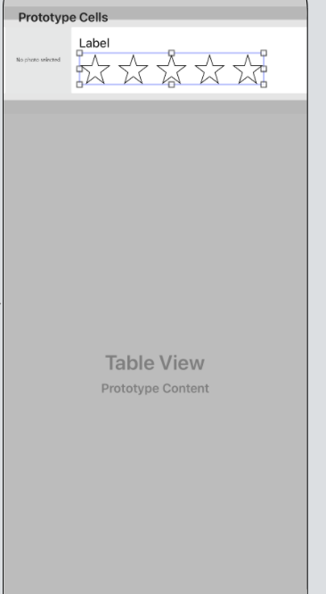

## 첫 iOS 앱 개발

1. class에 UITextFieldDelegate나 UIImagePickerControllerDelegate를 상속받아야 TextField와 ImageView의 액션을 구현할 수 있다.

2. ```swift
   //ViewController가 사용자가 이미지를 선택할 때 알아차릴 수 있도록 만든다.
   imagePickerController.delegate = self
   //여기서 UINavigationControllerDelegate를 상속하지 않으면 에러가 난다.
   ```

3. Tab Gesture Recognizer를 사용할 때에는 연결된 해당 객체의 속성에서 View->Interaction-> **User Interaction Enabled**에 체크가 되어있어야한다.

   - 체크가 안되있으면 클릭이 안됨!

4. ```swift
       private func setupButtons(){
           // 버튼 만들기
           let button = UIButton()
           button.backgroundColor = .red
           //constraint 추가
           //레이아웃 엔진에게 뷰 프레임과 오토리사이징마스크 속성에 따라 뷰의 크기와 위치를 정의하는 제약 조건을 만들도록 지시
           button.translatesAutoresizingMaskIntoConstraints = false
           //레이아웃 앵커에 액세스. 배치 앵커를 사용하여 constraint조건 작성 isActive는 구속 조건을 활성화하거나 비활성화
           button.heightAnchor.constraint(equalToConstant: 44.0).isActive = true
           button.widthAnchor.constraint(equalToConstant: 44.0).isActive = true
           //스택에 버튼 추가: 사용자가 작성한 버튼을 스택에 추가
           addArrangedSubview(button)
       }
   ```

5. ```swift
   button.addTarget(self, action: #selector(RatingControl.ratingButtonTapped(button:)), for: .touchUpInside)
   ```

   - 대상은 self인 클로징 클래스의 현재 인스턴스를 참조한다. 이 경우 RatingControl 버튼을 설정하는 객체를 가리킨다.
   - #selector표현은 반환 Selector에 제공된 방법에 대한 값. 여기서 ratingButtonTapped(_:) 메소드를 리턴한다. -> 버튼을 누르면 시스템이 액션 메소드를 호출할 수 있다.

6. for문에서 **0..<5** 표시는  0,1,2,3,4 총 5번 반복하도록

7. 코드로 화면을 그리면 클래스 앞에 **@Designable**이라는 키워드를 넣고 다시 빌드하면 스토리 보드에서 볼 수 있다.

8. **@IBInspectable은** 속성을 지정할 수 있다.

9. **didSet**은 속성이 변경될 때마다 감지하는 관찰자 역할을 한다. 속성 값이 설정된 직후에 호출.

10. 항상 오타를 주의해야한다. 특히 큰따옴표 안에 있는 문자는 에러 체크를 안해주기 때문에 신경써야한다.

11. Tests를 할 수 있다. ~~~~Tests.swift에 가면 테스트 코드들을 작성할 수 있는데 예외 상황일 경우를 설정할 수 있다.

    - ```swift
        //MARK: Meal Class Tests
          
          //Meal의 초기화가 유효한 파라미터인지 테스트
          func testMealInitializationSucceeds(){
              //0점 점수
              let zeroRatingMeal = Meal.init(name: "Zero", photo: nil, rating: 0)
              XCTAssertNotNil(zeroRatingMeal)
              
              //5점 점수
              let positiveRatingMeal = Meal.init(name: "Positive", photo: nil, rating: 5)
              XCTAssertNotNil(positiveRatingMeal)
          }
          
          //Meal의 초기화가 실패할 시
          func testMealInitializationFail(){
              //Negative Rating
              let negativeRatingMeal = Meal.init(name: "Negative", photo: nil, rating: -1)
              XCTAssertNil(negativeRatingMeal)
              
              //Empty String
              let  emptyStringMeal = Meal.init(name: "", photo: nil, rating: 0)
              XCTAssertNil(emptyStringMeal)
              
              //Rating exceeds maximum
              let largeRatingMeal = Meal.init(name: "Large", photo: nil, rating: 6)
              XCTAssertNil(largeRatingMeal)
          }
      ```

      - Cmd + U로 단위 테스트를 할 수 있다.

12. TableView 만들기

    1. TabelView Controller 생성

    2. ViewCell.swift 생성

    3. storyboard의 해당 Cell에 속성에서 Identifier를 지정하고, swift파일과 연결한다.

       - 커스텀 셀 만들기
         - 

    4. 테이블 셀 UI를 코드에 연결 (Assistant)

    5. 데이터 표시(데이터 소스와 delegate 이용)

       - 필요 조건

         - ```swift
           //테이블 뷰에 표시할 섹션 수를 알려줌.
           func numberOfSections(in tableView: UITableView) -> Int
           //테이블 뷰에 지정된 섹션에 표시할 행의 수를 알려줌
           func tableView(_ tableView: UITableView, numberOfRowsInSection section: Int) -> Int
           //지정된 행에 표시할 셀을 구성하고 제공.
           func tableView(_ tableView: UITableView, cellForRowAt indexPath: IndexPath) -> UITableViewCell
           ```

         - dequeueReusableCell(withIdentifier:for) 메소드는 테이블 뷰에서 셀을 요청한다. 사용자가 스크롤할 때 새 셀을 만들고 오래된 셀을 삭제하는 대신 테이블은 가능한 경우 셀을 재사용하려고 한다. 사용 가능한 셀이 없으면 새 셀을 인스턴스화하지만, 셀의 장면을 스크롤하면 재사용된다. 이 메소드는 어떤 유형의 셀을 작성하거나 재사용해야하는지 알려준다. 이 때, 커스텀 셀이면 커스텀 셀로 다운 캐스트 해줘야한다.

         - 데이터를 담고 있는 배열에서 데이터를 가져와 배치시켜준다.

           - ```swift
             //적절한 meal을 레이아웃에 배치한다. meals 배열에서 가져옴.
             let meal = meals[indexPath.row]
             cell.nameLabel.text = meal.name
             cell.photoImageView.image = meal.photo
             cell.ratingControl.rating = meal.rating
             ```

13. import os.log -> 통합 로깅 시스템으로 메시지가 나타나는 시기와 메시지가 저장되는 방식을 보다 자세하게 제어할 수 있다.

    - ```swift 
      os_log("The save button was not pressed, cancelling",log:OSLog.default, type: .debug)
      ```

14. Navigation 으로 구현된 save 버튼에서(unwind segue)

    - ```swift
      @IBAction func unwindToMealList(sender: UIStoryboardSegue){
        if let sourceViewController = sender.source as? MealViewController ,
        let meal = sourceViewController.meal{
      
          let newIndexPath = IndexPath(row: meals.count, section: 0)
          meals.append(meal)
      
          tableView.insertRows(at: [newIndexPath], with: .automatic)
        }
      }
      ```

    - 스토리 보드에서 Save 버튼을 종료항목으로 컨트롤 드래그한다
    
15. FoodTracker에서 네비게이션에서 cancel을 눌렀을 때 2가지 방안이 있다

    1. 추가할 때 cancel
    2. 편집할 때 cancel

    - 2가지 경우를 나누기 위해

      - ```swift
            @IBAction func cancel(_ sender: Any) {
                //Depending on style of presentation (modal or push presentation), this view controller needs to be dismissed in two different ways.
                let isPresentingAddMealMore = presentingViewController is UINavigationController
                
                if isPresentingAddMealMore{
                    dismiss(animated: true, completion: nil)
                }
                else if let owningNavigationController = navigationController{
                    owningNavigationController.popViewController(animated: true)
                }else{
                    fatalError("The MealViewController is not inside a navigation controller")
                }
            }
        ```

16. TabelView에서 목록 편집하는 버튼 만들기

    ```swift
    //테이블뷰 컨트롤러에서
    override func viewDidLoad(){
      super.viewDidLoad()
      navigationItem.leftBarButtonItem = editButtonItem
    }
    ```

    - 이렇게만 하면 삭제하기 버튼만 있고 구현은 안되어있다.

      ```swift
          override func tableView(_ tableView: UITableView, commit editingStyle: UITableViewCell.EditingStyle, forRowAt indexPath: IndexPath) {
              if editingStyle == .delete{
                  //데이터 소스에서 행을 삭제
                  meals.remove(at: indexPath.row)
                  tableView.deleteRows(at: [indexPath], with: .fade)
              }else if editingStyle == .insert {
                  //Create a new instance of the appropriate class, insert it into the array, and add a new row to the table view
              }
          }
          
          override func tableView(_ tableView: UITableView, canEditRowAt indexPath: IndexPath) -> Bool {
              //false를 리턴하면 edit을 못하도록 한다.
              return true
          }
      ```

      이 오버라이드를 추가하고 구현해야 비로소 삭제가 완료된다.

17. 네비게이션 컨트롤러 위에 네비게이션 컨트롤러가 올라갈 수 없기 때문에, 위에 올라가는 네비게이션 컨트롤러는 modal 스타일로 올라가게된다(show로 지정을 하더라도)

18. NSCoding과 NSObject

    - NSCoding
      - 클래스가 해당 클래스의 인스턴스를 인코딩하고 디코딩할 수 있도록 구현해야하는 두가지 방법을 선언한다. (저장과 배포의 기초)
      - OOP 설계원리를 따라 인코딩되거나 디코딩 되는 객체는 해당 인스턴스 변수를 인코딩하고 디코딩하는 역할을 담당한다.
      - encode(with: )
        - 클래스 정보를 보관할 준비를 하고 이니셜라이즈는 클래스를 만들 때 데이터를 보관 해제한다.
    - NSObject
      - 대부분의 Objective-C클래스 계층의 루트 클래스입니다. 여기서 하위 클래스는 기본 인터페이스를 런타임 시스템에 상속하고 Object-C 개체로 동작하는 기능을 상속한다.

19. NS의 뜻이 무엇인가..

    - 이런 접두사는 같은 식별자가 두 개의 다른 대상에 쓰일 때 결과적으로 큰 문제가 되는 이름 충돌(name collisions) 사태를 막는데 도움이 된다
    - NS접두사는 이 툴킷이 NextSTEP이라고 불리며 NeXT Software의 제품이었던 때로 거슬러 올라간다. NextSTEP을 위해 이미 작성된 코드와의 호환을 유지하기 위해 애플은 NS 접두사를 쓴다.

    > NS는 회사 이름이고 , 거기에서 뭐 추가해서 만든 클래스들의 기능을 쓰기 위해 사용...

20. Alert Action 구현하기

    ```swift
    @IBAction func addName(_ sender: Any) {
            
            //alert 버튼 생성
            let alert = UIAlertController(title: "New Name", message: "Add a new name", preferredStyle: .alert)
            let saveAction = UIAlertAction(title: "Save", style: .default){
                [unowned self] action in
                guard let textField = alert.textFields?.first, let nameToSave = textField.text else{
                    return
                }
                
                self.names.append(nameToSave)
                self.tableView.reloadData()
            }
            
            let cancelAction = UIAlertAction(title: "Cancel", style: .cancel)
            
            alert.addTextField()
            alert.addAction(saveAction)
            alert.addAction(cancelAction)
            
            present(alert, animated: true)
        }
    ```

21. appDelegate 안에 list를 구현할 때, 각 중괄호 안에 변수를 만들어서 쓰면 스코프가 다르게 적용되면서 각각의 리스트가 생성된다. 따라서 하나의 파일 안에 여러개의 self.appDelegate.memolist를 구현해야 한 리스트 안에 데이터가 들어간다.
