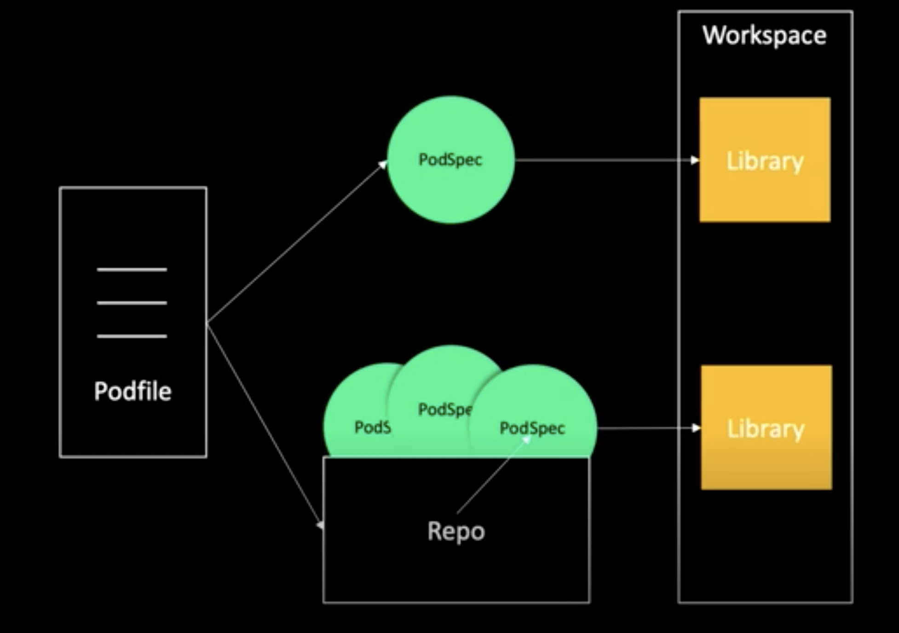

## CocoaPods

- iOS의 의존성 도구


### 1. 의존성 관리 도구

- 의존성이란?
  - 변경 가능성.
- 라이브러리의 변경을 관리
- 명령어 하나로 간단하게 라이브러리를 설치
- 주요 기능
  - Module: 의존성을 알려주는 메타데이터로 라이브러리들이 관리됨
  - Manifest: 명세서 역할
  - Lock: 설치된 라이브러리의 버전과 의존 구조를 보여줌 ex) Podfile.lock
  - Repository: 모듈이 저장된 공간, 보통 깃헙 저장소를 사용
  - Dependency Constraint: 모듈의 허용되는 버전
  - Resolution Rule: 모듈의 적합한 버전을 설치
- CocoaPods
- Carthage
- Swift Package Manager


### 2. 사용하기

```
sudo gem install cocoapods

//podfile 열고

# Uncomment the next line to define a global platform for your project
# platform :ios, '13.0'	//플랫폼 지정

target 'CocoaProject' do
  # Comment the next line if you don't want to use dynamic frameworks
  use_frameworks!	//Static library 대신 framework사용

   # Pods for CocoaProject
  pod 'SnapKit', '~> 5.0.0' //최소 5.0.0 이상 6.0.0미만을 사용
  pod 'Kingfisher', '5.13.1'

  target 'CocoaProjectTests' do //상위 target의 설정을 가져옴
    inherit! :search_paths
    # Pods for testing
    pod 'Quick'
    pod 'Nimble'
  end

  target 'CocoaProjectUITests' do
    # Pods for testing
  end

end
```

- 후에 pod install 을 하면 여러 파일이 생긴다. 이제 xcworkspace라는 파일로 작업을 해야한다.


### 3. 자세히 보기

- 전체적인 흐름

  - 

  - | 논리 연산자 | 의미 |
    | ----------- | ---- |
    | '> 0.1'     | 초과 |
    | '>= 0.1'    | 이상 |
    | '< 0.1'     | 미만 |
    | '<= 0.1'    | 이하 |

    | 낙관적 연산자 | 의미                |
    | ------------- | ------------------- |
    | '~< 0.1.2'    | 0.1.2이상, 0.2 미만 |
    | '~> 0.1'      | 0.1이상 1.0 미만    |

- 경로 지정

  - 로컬(직접 라이브러리 개발할 때 사용)
    - Pod 'Alamofire', :path => '~/~~~~'
  - 마스터 branch 기준
    - Pod 'Alamofire', :git => 'https://~~~~'
  - 특정 branch 기준
    - Pod 'Alamofire', :git => 'https://~~~~', :branch => 'dev'

- pod install vs pod update

  - install
    - 처음 pod을 설치할 때, Podfile에 pod을 추가, 변경, 삭제할 때 사용
    - 설치된 라이브러리의 버젼 정보가 Podfile.lock 파일에 기록됨
    - 다음 번에 install을 실행하면 podfile.lock에 기록된 버전으로 라이브러 설치 기록되어 있지 않다면  podfile에 명시된 버전을 찾아서 설치
    - 새로운 pod을 설치할 때
  - update
    - pod update podName을 입력하면 pod file.lock을 참고하지 않고, 한도 내 최신 라이브러리를 설치
    - pod이 새로운 버전이 있는지 확인하고 업데이트 하고 싶을 때 사용


