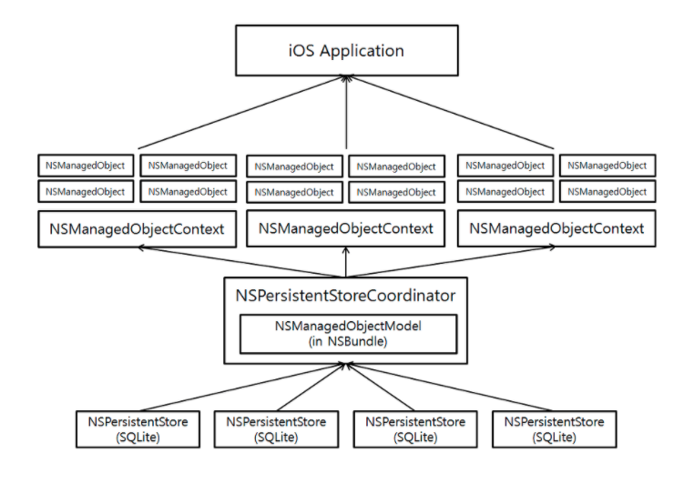

## Core Data 작동 방식


##### 1. NSPersistentStore(영구저장소)

- 데이터를 저장하는 파일을 나타낸다.
- 앱에서 코어 데이터를 이용하도록 설정할 때 영구 저장소의 이름, 위치, 타입을 지정해야한다.


##### 2. NSPersistentStoreCoordinator(영구 저장소 관리자)

- 객체의 데이터를 실제로 저장하고 있는 실제 파일(NSPersistentStore)과 앱이 사용하는 객체 모델 사이를 중개한다.
- 앱은 NSPersistentStoreCoordinator에 직접 접근할 일이 거의 없다.
- 단지 코어 데이터 실행환경을 구성할 때 관리자 객체를 생성해주기만 하면된다.
- NSPersistentStoreCoordinator는 하나 이상의 영구 저장소와의 통신을 관리하기 때문에 데이터가 어떻게 저장되는지를 앱으로부터 감춘다.


##### 3. NSManagedObjectContext(관리 객체 컨텍스트)

- 관리 객체가 존재하는 영역
- 앱에서는 관리 객체의 생성, 삭제, 편집, 질의 등을 수행하기 위해 NSManagedObjectContext와 통신한다.
- NSManagedObjectContext는 객체들의 변경사항을 관리하며 모든 변경사항을 한꺼번에 저장하거나 경우에 따라서는 rollback한다.
- 전체 데이터 작업을 분리하거나 제한하기 위해 하나 이상의 context를 동시에 사용할 수 있다.


##### 4. NSManagedObjectModel(관리 객체 모델)

- 관리 객체는 관리 객체 모델(NSManagedObjectModel) 에서 정의한다.
- NSManagedObjectModel은 개체(Entity)의 리스트, 각 개체와 연결된 속성리스트(properties), 각 개체 및 속성과 연결된 유효성 검증, 개체 간의 관계를 포함한다.
- 관리 객체 모델은 주로 XCode의 데이터 모델 편집기를 이용해 생성한다.


##### 5. NSManagedObject(관리 객체)

- 코어 데이터 상에서 실제 정보를 담고 있는 객체를 의미한다.

- 관리 객체를 키와 그 키에 대응하는 타입의 객체를 가진 Dictionary 객체처럼 생각할 수 있다.

- ```swift
  MOModel setValue:@ "Casblanca" forKeyy:@"movieName"
  ```


##### 6. NSFetchedResultsController(추가기능)

- Fetch 요청의 결과와 테이블 뷰를 손쉽게 연결시켜준다.
- 이 컨트롤러는 Fetch결과를 섹션과 줄 단위로 리턴하도록 설정할 수 있고, 인덱스를 이용해 접근할 수 있다.
- 테이블 뷰를 구현할 때 필요한 정보를 얻을 수 있는 메소드도 제공하며, 코어데이터에서 변경 이벤트가 발생하면 이를 감지한 후 delegate 메소드를 이용해 테이블에 반영할 수 있다.


-----------



