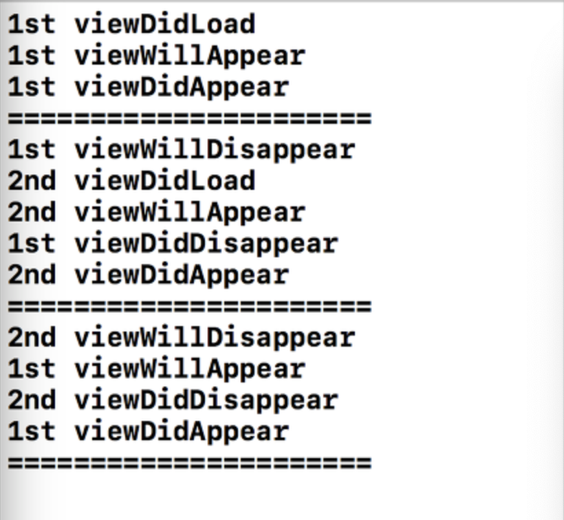

## View Controller의 생명주기(Life-Cycle)

### View Controller 생명주기

> 보여줬다가~~~~ 사라졌다.

### 1. viewDidLoad()

- "Called after the controller's view is loaded into memory"

  > 뷰의 컨트롤러가 메모리에 로드되고 난 후에 호출됩니다.

- viewDidLoad는 뷰의 로딩이 완료 되었을 때 시스템에 의해 자동으로 호출되기 때문에 일반적으로 리소스를 초기화하거나 초기화면을 구성하는 용도로 주로 사용.

- 화면이 처음 만들어질 때 한 번만 실행되므로, 처음 한 번만 실행해야하는 초기화 코드가 있을 경우 여기에 작성한다.

### 2. viewWillAppear

- 뷰가 이제 나타날 것이라는 신호를 컨트롤러에게 알리는 역할.

- 즉 뷰가 나타나기 직전에 호출된다.

- 그럼 viewDidLoad도 뷰가 나타나기 전에 호출되는데 같은거 아닐까??

  > No!!!
  >
  > viewDidLoad는 오직 한 번만 호출된다.
  >
  > 하지만, viewWillAppear은 화면이 다시 돌아오면 또 호출된다.

### 3. viewDidAppear

- 뷰가 나타났다는 것을 컨트롤러에게 알리는 역할을 한다.
- 화면에 적용될 애니메이션을 그림.
- 뷰가 화면에 나타난 직후에 실행.

### 4. viewWillDisappear

- 뷰가 사라지기 직전에 호출되는 함수
- 뷰가 삭제되려고 하고 있는 것을 뷰 컨트롤러에 통지

### 5. viewDidDisappear

- 뷰 컨트롤러가 뷰가 제거되었음을 알려준다.

## 정리

- 1st -> 2nd -> 1st 가는 상황
- 1st viewDidDisappear는 2nd viewWillAppear 호출 후에 호출된다!!!
- viewDidLoad는 오직 한번만 호출!
