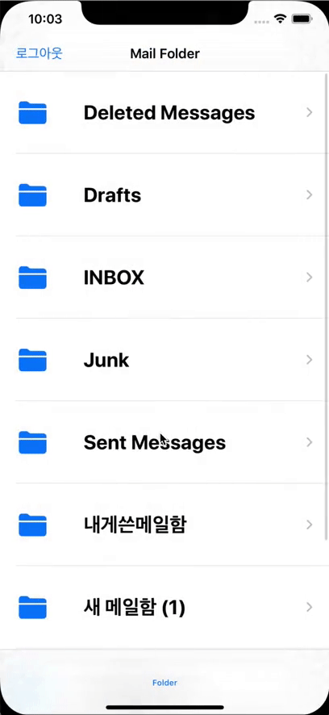

- 메일 폴더 화면을 연속으로 왔다 갔다거리는 동작을 하면 중간에 메일리스트가 비어 있는 상황을 마주쳤습니다.

- self를 사용하는 메일리스트를 동기화 하는 과정에서 다른 메일 폴더로 들어갔을 때 강한 참조로 인해 끊지 못하여 발생한 이슈였습니다.
- self는 클로저가 해제될 때까지 기다리는 strong reference cycle 상황에 있었습니다.
- 강한 참조로 생기는 이슈를 해결하기 위해 세션 클로저 안에 weak self를 명시하여 strong reference cycle을 피하여 해결할 수 있었습니다.

- 앞으로 클로저를 이용한다면 어떤 상황에서 strong reference cycle이 발생하는지 사용하기 전에 알기 어렵기 때문에 클로저 내부에서 self를 사용한다면 weak self를 명시하는 습관을 들여야겠습니다.

