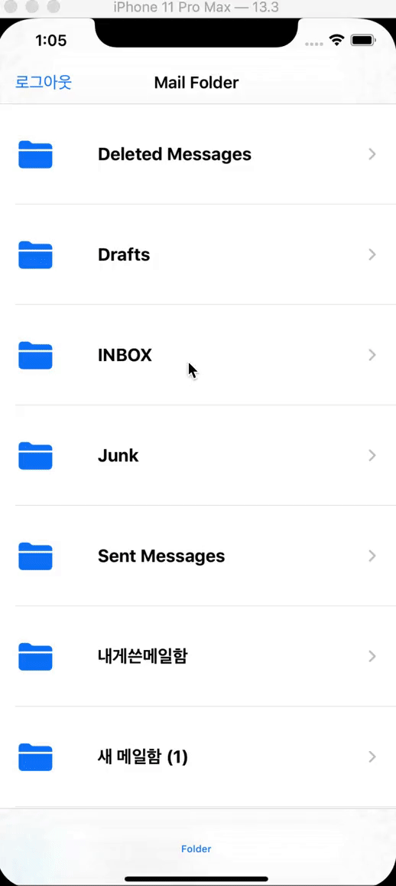
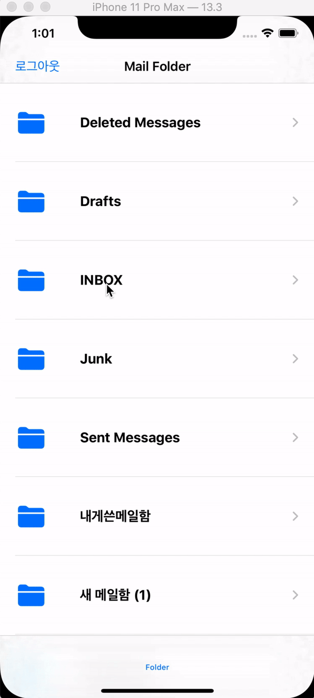

- Search Bar을 통해 검색 기능을 구현하는 과정에서 이슈가 발생했습니다.

  

- 메일 리스트 화면이 나타나자마자 검색을 하여 결과를 얻으면, 메일리스트를 동기화 하는 과정에서 필터링된 메일리스트와 IMAP 서버에 있는 메일리스트가 비교하여 필터링 안된 메일들을 추가하여 같은 메일이 여러개 생기는 이슈가 발생했습니다.
- 이를 해결하기 위해 기존의 메일리스트말고 filtered 메일리스트라는 리스트를 하나 더 만들어서 기존의 메일리스트는 데이터 동기화하는데 사용하고, filtered 메일리스트는 기존의 메일리스트의 데이터를 받아 ui에 표시되도록 했습니다.

