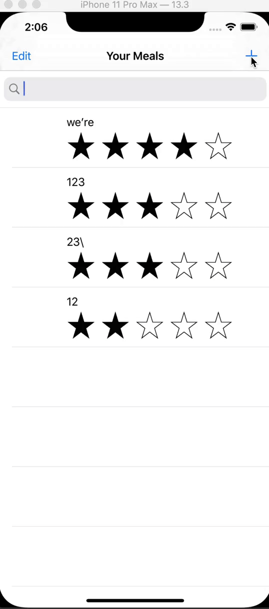
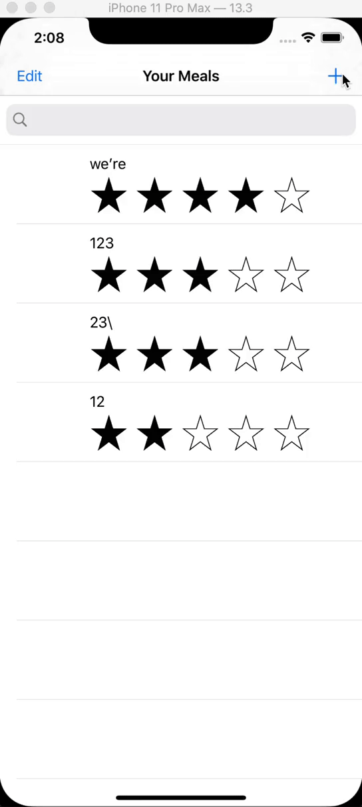

- NSFetchedResultController을 예제에 적용하는 도중에 insert가 되지 않는 이슈가 있었습니다.

- 해당 이슈를 해결하기 위해 많은 방법을 시도했었지만 해결하지 못했습니다.
- 문제는 fetchedResultController을 각 클래스에서 싱글톤 패턴이 아니라 그냥 선언했기 때문이였습니다.
- 이를 해결하기 위해 코어데이터를 관리하는 클래스에 shared를 static으로 만들어, 다른 클래스에서 오직 하나뿐인 인스턴스로 접근했더니, 잘 해결할 수 있었습니다.

- 감격스러운 순간이였습니다...