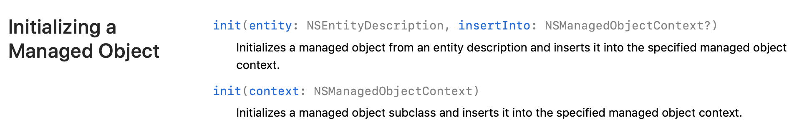

### Core Data Managed Object 초기화 방법 2가지 차이?

- 코어 데이터의 NSFetchedResultController을 공부 하는 중에 데이터를 insert하기 위해 Managed Object를 초기화해야되는 경우가 있었습니다.

  ```swift
  let entity = NSEntityDescription.entity(forEntityName: "Meal", in: MealDAO.shared._fetchedResultsController!.managedObjectContext)
  //첫번째 방법
  object = MealMO(entity: entity!, insertInto: MealDAO.shared._fetchedResultsController?.managedObjectContext)
  //두번째 방법
  object = MealMO(context: self.dao.fetchedResultsController.managedObjectContext)
  ```

  - 이 소스는 MealTableViewController가 아닌 다른 ViewController에서 작성된것입니다.

- 두 방법 모두 정상적으로 데이터를 넣을 순 있었습니다.

- 두 개의 차이를 알기 위해 공식 문서를 찾아봤습니다.

- 

- init(entity: NSEntityDescription, insertInto: NSManagedObjectContext?)
  - Managed Object를 초기화하고 지정된 Managed Object Context에 데이터를 넣습니다.
- init(context: NSManagedObjectContext)
  - Managed Object의 하위 클래스를 초기화하고 지정된 Managed Object Context에 데이터를 넣습니다.


- 차이..
  - 첫번 째 방법은 엔티티를 직접 명시해준 것이고, 두번 째 방법은 엔티티를 직접 명시하지 않아도 fetchedResultsController의 서브 클래스에 명시되있는 엔티티를 이용하는 것이였습니다.

