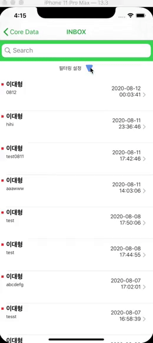

## Date Picker 스크롤링 중 값 제대로 못가져오는 이슈

- Date Picker을 스크롤링을 하던 중 무심코 확인 버튼을 눌렀는데, 해당하는 값을 가져오지 않고 멈춘 시점의 값을 가져오는 이슈를 발견했습니다.

- 해당 이슈를 해결하기 위해 Swiping Gesture Recognizer를 통해 Date Picker가 스크롤 중인지 아닌지 판단했습니다. 
- 만약 스크롤 중이라면 Done 버튼을 비활성화하고, 스크롤이 끝나 값이 바뀌면 Date Picker의 valueChange 액션 메소드를 통해 Done버튼을 활성화하여 이슈를 해결했습니다.

