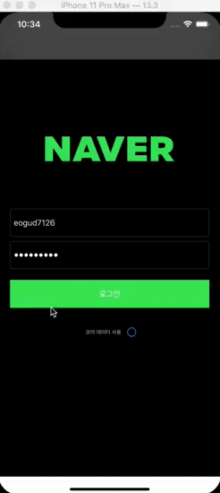

## Dark 모드 전환시 발생한 이슈

- 다크 모드로 테마를 바꾸면 기존의 테마에서 잘 나오던 화면이 색상이 다르게 나오는 것을 확인했습니다.

  

  

- 다크모드에 대응하기 위해 애플 문서에서는 System Color을 사용하라는 말이 있었습니다.

- 저는 custom 색상을 사용하기 위해 Assets에 들어가 색상을 하나 만든 뒤 Any(13버전 이하), Light, Dark 모드의 색상을 각각 지정해줬습니다.

- 색상을 만든 후 기존의 색상을 바꾸면 다크모드일 때, 라이트 모드일 때에 따라 색상이 바뀌는 것을 확인할 수 있었습니다.

