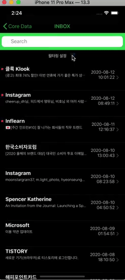
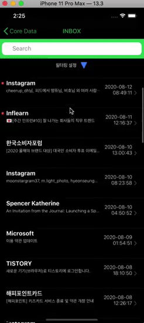
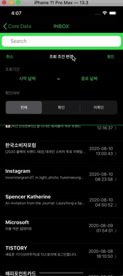

## date picker 뷰 외의 화면 이슈, 테이블 뷰 클릭 안되는 이슈

- Date picker를 띄우고 또 다시 Date picker를 띄우면 done을 눌러도 뷰가 사라지지 않는 이슈가 있었습니다.




- 이를 위해 하나의 UIView를 만들어 전체 화면을 덮고, 뷰를 투명하게 하여 다른 뷰들을 클릭하지 못하게 했고, tap gesture recognizer를 통해서 다른 뷰를 클릭하면 Date picker 뷰가 사라지도록 했습니다.
- Tap gesture recognizer를 만들자, 테이블 뷰의 셀들이 클릭 되지 않는 이슈가 생겼습니다.



- 이를 해결하기 위해서 제스처가 인식될 때 해당 터치 이벤트가 뷰에도 전달되는지와 관련 있는 옵션인 cancelsTouchesInView를 false로 세팅하니 해결할 수 있었습니다.

```swift
tapGesture.cancelsTouchesInView = false
```

